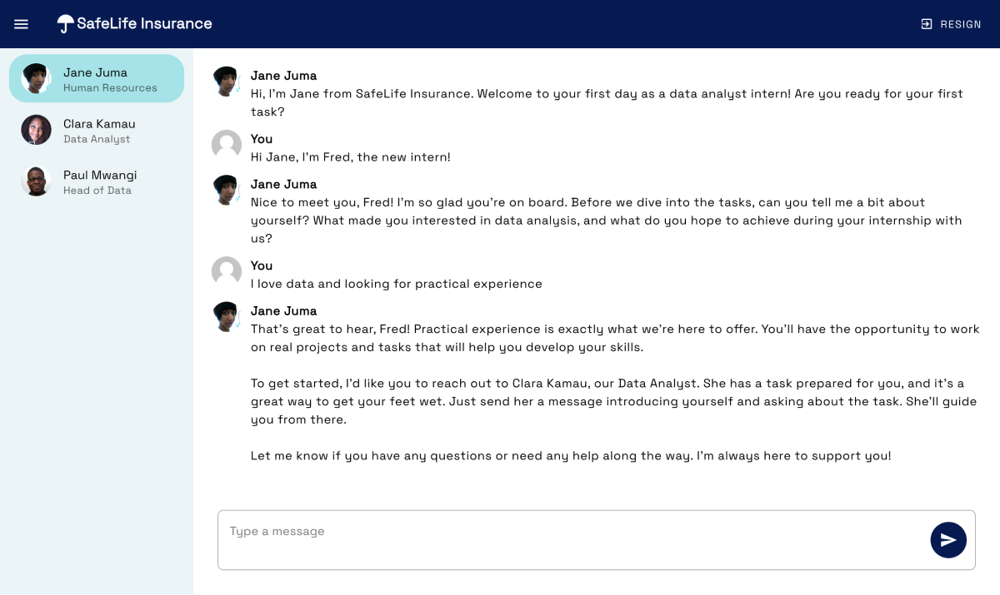

<p align="center">
  
</p>

# Internships for everyone

Millions of young Africans want a job, but internships and skill-building opportunities remain scarce. What if we use Llama 3 to simulate internships for everyone and reduce barriers to employability at scale?

## How it works

Our ‘Data Analyst’ internship simulation leverages the Meta Llama 3 70B Instruct model, hosted by Replicate. We simulate interactions with three realistic coworkers from a fictional 'SafeLife Insurance' company in Kenya, guiding the intern through their experience. Each virtual coworker has a chat thread with a detailed system message defining their personality, the team and company context, and the intern's tasks and expected deliverables.

(Demo)[https://unlimited-internships-66awdaotla-uc.a.run.app/]

## Specs

- Nuxt3 web app
- Vuetify for UI + Google Font
- Meta Llama 3 70B Instruct model [(License)](https://llama.meta.com/llama3/license/) via [Replicate](https://replicate.com)

## Setup

1. Create a [Replicate](https://replicate.com) account and obtain you api token to send requests for the LLama 3 model.

2. Clone the repo and create a .env file in route directory:

```env
NUXT_PRIVATE_REPLICATE_API_TOKEN='your_api_token'
# Optionally set port for the local dev server:
PORT=3000
```

3. Make sure to install the dependencies:

```bash
# npm
npm install

# pnpm
pnpm install

# yarn
yarn install

# bun
bun install
```

4. Edit the `assets/instructions.json` file to customize the internship simulation scenario.

## Development Server

Start the development server on `http://localhost:3000`:

```bash
# npm
npm run dev

# pnpm
pnpm run dev

# yarn
yarn dev

# bun
bun run dev
```

## Production

Build the application for production:

```bash
# npm
npm run build

# pnpm
pnpm run build

# yarn
yarn build

# bun
bun run build
```

Locally preview production build:

```bash
# npm
npm run preview

# pnpm
pnpm run preview

# yarn
yarn preview

# bun
bun run preview
```

Check out the [deployment documentation](https://nuxt.com/docs/getting-started/deployment) for more information.
A Dockerfile has already been added for Docker deployment, e.g. Cloud Run
